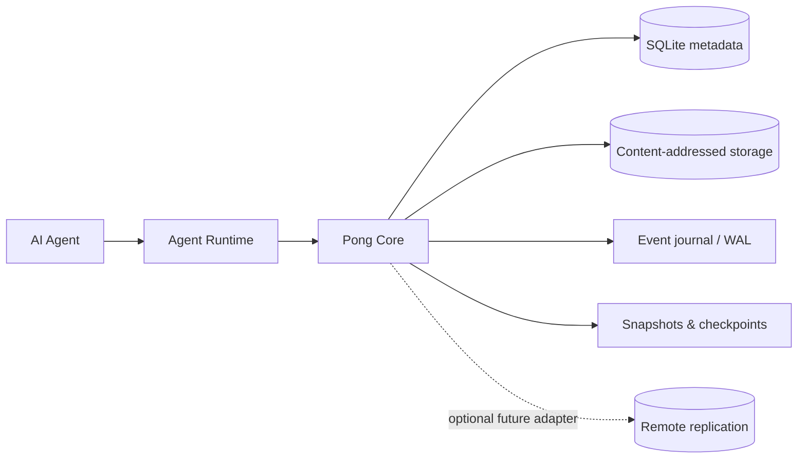
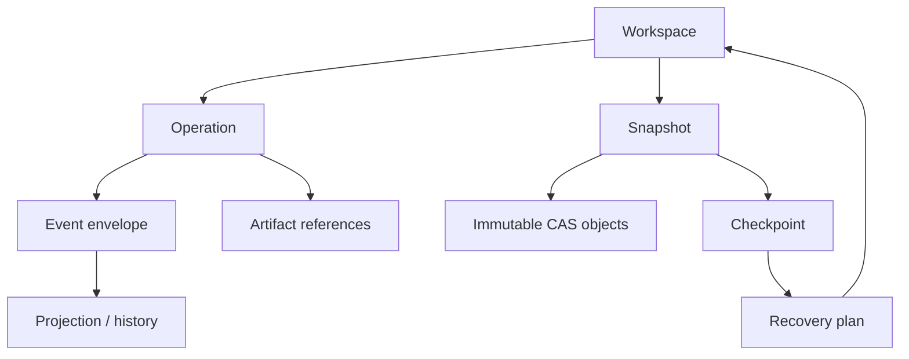
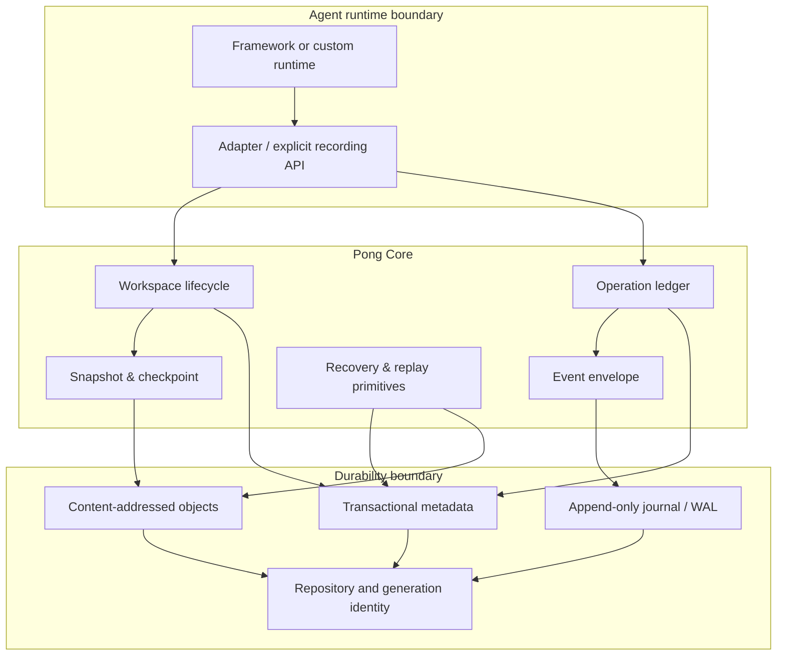
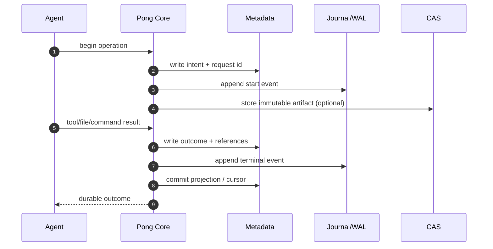
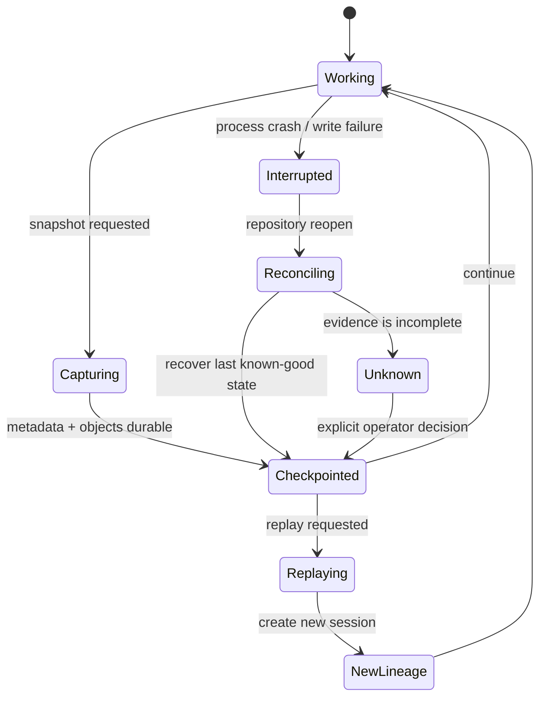
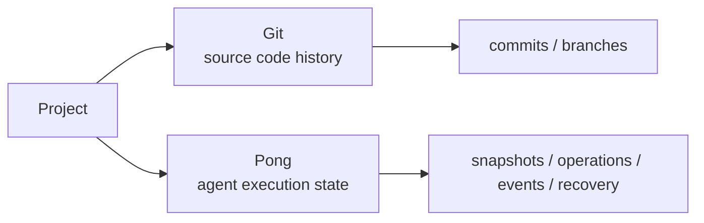

# Pong

<p align="center">
  <strong>Durable execution state for AI agents</strong>
  <br />
  <sub>让 Agent 的执行过程可追踪、可快照、可恢复、可回放。</sub>
</p>

<p align="center">
  <a href="https://github.com/NJHTR/pong/tree/dev">dev branch</a>
  · <a href="docs/README.md">Documentation</a>
  · <a href="docs/roadmap/ROADMAP.md">Roadmap</a>
  · <a href="docs/development/DEVELOPMENT_GUIDE.md">Development guide</a>
</p>

> **项目状态：早期开发，M1 release gate 尚未通过。**
> 当前仓库提供的是内部 test-gated Rust durable-primitives core，以及受限的
> M2 workspace/snapshot 和 M3 operation-ledger 实现切片。它还不是 production-ready
> 产品，也不承诺 public CLI、SDK、server、UI 或 provider/runtime contract。

## 为什么需要 Pong

Agent 不只是生成文本，它会修改文件、运行命令、调用工具、改变环境，并在长时间运行后留下大量上下文。传统 Agent runtime 通常只关心“这次执行成功还是失败”，却很难回答：

- 最后一个已知良好的状态是什么？
- 哪个 operation 造成了失败？
- 发生崩溃后，哪些状态已经可靠落盘？
- 能否从 checkpoint 恢复，并重放同一条执行路径？
- 多个 Agent 是否可以在隔离 workspace 中安全协作？

Pong 的职责是保存这些 **durable execution state**。它位于 Agent framework 和本地存储之间，提供可验证的状态边界，而不是替 Agent 做推理或调度。



## 核心模型

Pong 将一次 Agent 执行拆成几层相互关联、但职责明确的对象：

| 对象 | 作用 | 典型问题 |
| --- | --- | --- |
| **Workspace** | Agent 实际读写的工作目录和环境边界 | 当前工作状态在哪里？谁持有 lease？ |
| **Operation** | 一次有意义的执行单元，如 tool call 或 command | 哪次动作改变了状态？ |
| **Event** | 按顺序追加的执行事实 | 发生了什么？顺序和因果关系是什么？ |
| **Artifact** | 不可变的大对象或外部结果引用 | 结果内容如何校验和复用？ |
| **Snapshot** | Workspace 在某一时刻的可复现树状态 | 如何保存一个 known-good state？ |
| **Checkpoint** | 面向恢复的命名位置 | 从哪里继续执行？ |
| **Generation** | 一组一致的 metadata、CAS 和 selector | 如何避免迁移时混用新旧数据？ |

这些对象不是孤立的：operation 产生 event，event 引用 artifact，snapshot 固化 workspace，checkpoint 指向可恢复状态。



## 架构

Pong 采用 local-first 设计。v0.x 的本地 journal、metadata 和 object store 是权威数据源；网络同步只能作为后续 adapter，不能成为核心写入路径的隐式依赖。



### 存储边界

核心存储由三类 durable primitive 组成：

1. **Metadata**：SQLite 中的事务性记录、引用、lease、operation 和 projection 状态。
2. **CAS**：按内容哈希寻址的不可变对象，用于 snapshot、artifact 和 manifest。
3. **Journal/WAL**：记录事件顺序和恢复所需的 durable evidence。

仓库启动时通过 `.pong/repository.json` 验证 repository identity、schema 和 active generation，然后再打开 metadata 与 CAS。启动检查失败会 fail closed，不会把不完整或不兼容的仓库报告为健康。

## 一次执行如何落盘

下面的流程强调一个重要边界：只有在事实已经达到约定的 durability point 后，operation 才能被报告为 durable。



Pong 对 crash、重复投递和不完整捕获保持显式态度：不确定的结果会被标记为 unknown 或 incomplete，而不是静默丢弃。

## 快照、恢复与重放

Snapshot 只描述可验证的 workspace 内容；Recovery 负责把状态恢复到某个 checkpoint；Replay 则创建新的 session 和 lineage，不改写原始 DAG 或 event log。



恢复外部副作用并不由 Core 自动宣称完成。文件、进程、网络、数据库等资源必须有明确 adapter contract、权限边界和证据，才能进入可用的 recovery workflow。

## 当前实现范围

### 已存在的内部实现

- Rust durable repository core
- canonical JSON、typed identity 和 schema/version checks
- SQLite metadata adapter
- content-addressed storage
- event、projection、WAL tail recovery primitives
- repository generation migration 和 selector validation
- workspace lease、local filesystem driver、tree snapshot
- operation ledger 的内部切片
- redaction、fault injection、property tests 和跨平台验证材料

### 尚未承诺的能力

- public CLI 和稳定的 `v0.1` SDK
- runtime interception 或任何特定 Agent framework adapter
- server、web UI 和 remote replication service
- production support matrix
- M1 release gate 通过后的兼容性承诺

## 快速开始

### 环境要求

- Rust `1.78` 或兼容的更新版本
- Windows、Linux 等平台的本地文件系统

### 构建与测试

```bash
cargo check --locked
cargo test --locked
cargo fmt --check
```

发布前的完整验证还包括 clippy、故障注入、property corpus、迁移和平台专项证据。请先阅读 [`docs/development/DEVELOPMENT_GUIDE.md`](docs/development/DEVELOPMENT_GUIDE.md) 与 [`docs/development/M1_EVIDENCE.md`](docs/development/M1_EVIDENCE.md)。

### 从哪里开始读代码

```text
src/
├── repository.rs       repository identity, generations, startup checks
├── metadata.rs         SQLite metadata and transactional records
├── cas.rs              immutable content-addressed objects
├── workspace.rs        workspace lifecycle and snapshots
├── canonical.rs        deterministic serialization and hashing
├── redaction.rs        secret-aware structured redaction
└── error.rs            stable error categories
```

根目录之外的设计权威在 [`docs/`](docs/README.md)：

| 目录 | 内容 |
| --- | --- |
| `docs/vision/` | 产品边界与设计原则 |
| `docs/architecture/` | 系统、运行时、数据和存储架构 |
| `docs/protocol/` | API、CLI、事件和版本协议 |
| `docs/reliability/` | 一致性、故障、恢复和幂等性 |
| `docs/security/` | 权限、信任边界和秘密处理 |
| `docs/decisions/ADR/` | 已确认的架构决策 |
| `docs/roadmap/` | 里程碑、状态和下一步任务 |
| `artifacts/` | 测试、性能和平台验证材料 |

## Roadmap

```mermaid
flowchart LR
    P0[Phase 0<br/>Research & architecture] --> P1[Phase 1<br/>Durable core]
    P1 --> P2[Phase 2<br/>Workspace & snapshot]
    P2 --> P3[Phase 3<br/>Operation history]
    P3 --> P4[Phase 4<br/>Versioning & collaboration]
    P4 --> P5[Phase 5<br/>Recovery & replay]
    P5 --> P6[Phase 6<br/>Stable API & CLI]
    P6 --> P7[Phase 7<br/>Framework adapters]
    P7 --> P8[Phase 8<br/>Drivers & observability]
    P8 --> P9[Phase 9<br/>Replication & service mode]
```



当前工作集中在 **Phase 1 - M1 Durable primitives release audit**。M1 尚未通过前，M2/M3 只作为内部、test-gated development slices 保留，不升级为 public release claim。详细状态请看 [`docs/roadmap/NEXT_TASK.md`](docs/roadmap/NEXT_TASK.md)。

## 设计边界

Pong 是 Agent infrastructure，不是：

- LLM 或模型供应商
- prompt management system
- Agent planner、scheduler 或 workflow orchestrator
- Multi-Agent framework
- Git 的替代品

Git 负责 source code versioning；Pong 负责 agent execution state。两者可以并行存在：



## 贡献

在修改核心持久化语义前，请先阅读：

1. [`docs/roadmap/NEXT_TASK.md`](docs/roadmap/NEXT_TASK.md)
2. 相关 architecture、protocol、security 和 reliability 文档
3. 适用的 ADR、测试策略和 release gate

涉及 identity、event、permission、migration 或 recovery 的行为变化，应同时补充测试、失败路径、迁移说明和必要的 ADR。贡献流程详见 [`docs/development/CONTRIBUTING.md`](docs/development/CONTRIBUTING.md)。

## License

License information will be added before the first public release.

<p align="center">
  <sub>Pong · Durable execution state for AI agents</sub>
</p>
